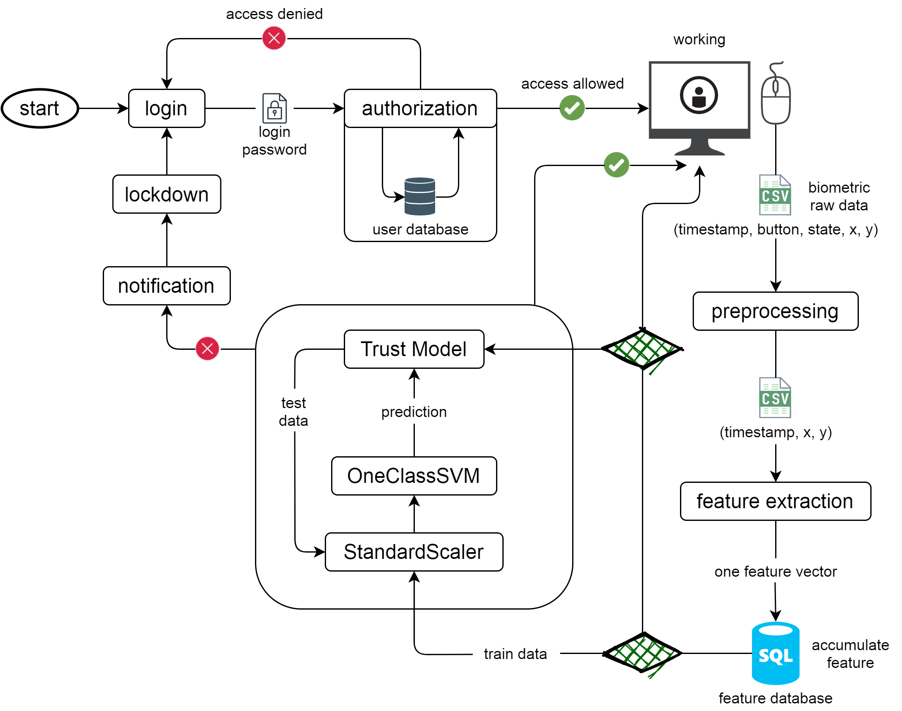

# pyProject



### Load:
```sh
$ git clone https://github.com/Berezniker/pyProject.git
$ cd pyProject
```

### Compile:
```sh
$ source venv/bin/activate
$ python compile.py
$ deactivate
```
(this process can take up to two minutes)

### Simple Start:
```sh
$ ./MMouse.exe
```

### Advanced Mode:

Command Line Arguments, see more:
```sh
$ ./MMouse.exe -- help
```
* `--login`: User LogIn;
* `--password`: User Password;
* `--ttime-value`: Time between checks;

### Sudo Root Mode:

* `--get-login-from-environment`: Get LogIn from environment and create Password;
* `--min-n-action`: minimum number of actions per `--ttime-value` seconds;
* `--min-train-size`: minimum number of data to train the model;
* `--duration-notification`: time between notification and blocking;
* `--log-level`: level for logger;
* `-A`, `-B`, `-C`, `-D`, `--trust-model-lockout`: Trust Model Params;
* `--one-class-svm-kernel`, `--one-class-svm-gamma`, `--one-class-svm-nu`: OneClassSVM Params;

### Support

<alexxsewell@icloud.com>